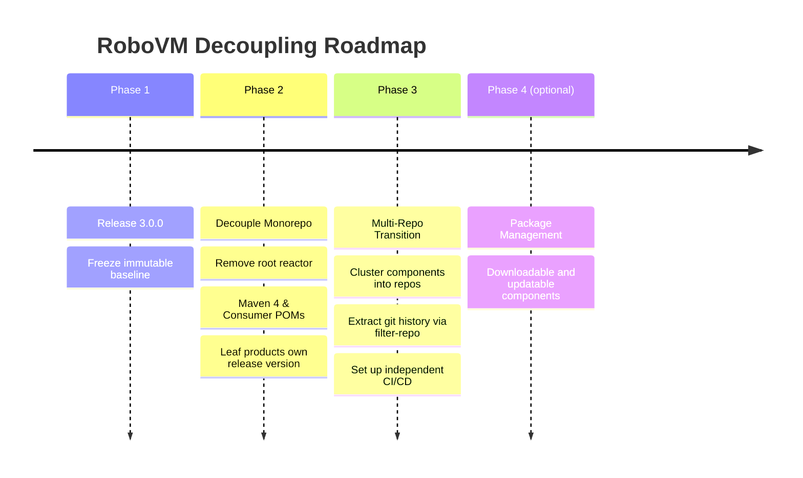
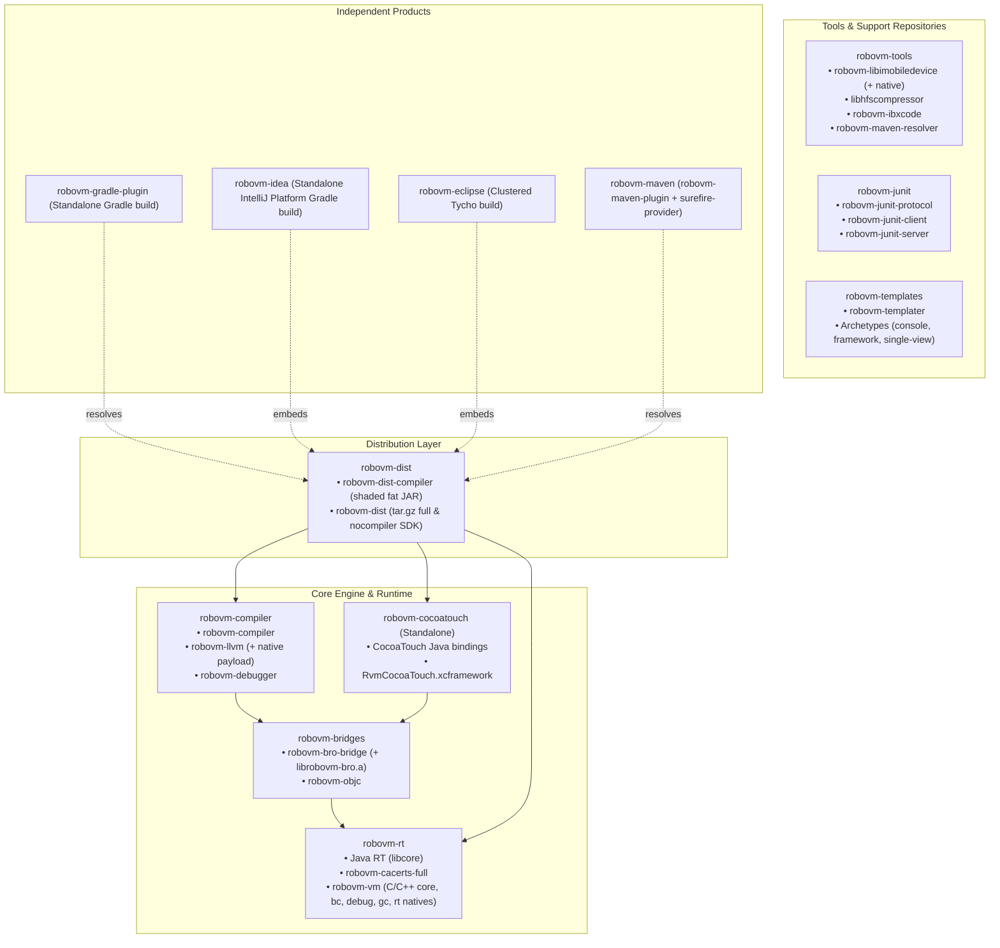

Copy of text from [discussion #879](https://github.com/MobiVM/robovm/discussions/879) on MobiVM/robovm repo. 

This document defines the architecture, version policy, and multi-phase execution plan to transition the RoboVM project from its current monolithic release model into an independently versioned and released component ecosystem.

---

## 1. Executive Summary & Problem Statement

The RoboVM project currently operates as a monolith where all components (compiler, runtime, native VM, bindings, and IDE plugins) share a single global version (`3.0.0-SNAPSHOT`) and release simultaneously. This model creates critical operational bottlenecks:

- **Release Coupling & Blockers:** A minor fix in the IntelliJ plugin or CocoaTouch bindings forces a full release of all 20+ modules. A build failure in an unrelated component (e.g., an Eclipse Tycho repo timeout) completely blocks urgent leaf-tool updates.
- **Publishing Overhead & Sonatype Quotas:** Re-uploading dozens of unchanged multi-megabyte native binaries and full SDK archives on every minor fix slows down releases and risks hitting Sonatype Maven Central publishing limits.
- **Code-Level Version Lock-In:** Plugins hardcode calls to `Version.getCompilerVersion()` to locate SDK artifacts and unpack directories, making independent component evolution physically impossible in code.
- **Heavy Developer Toolchain:** Working on a single leaf module (such as the Gradle or IDEA plugin) requires maintaining the entire cross-compilation toolchain (CMake, multi-target Clang, Tycho, Java) and compiling the full reactor.
- **Downstream Consumer Churn:** iOS app developers seeking a simple IDE plugin update are forced to upgrade their compiler and runtime lockstep, re-downloading gigabytes of SDK bundles and taking on unnecessary regression risks.

**Target Objective & Benefits:**
This migration transitions RoboVM into an independently versioned and released component ecosystem. By eliminating the monolithic build reactor and severing product-level version lock-in, publishing overhead to Maven Central is drastically reduced.
<!-- more -->

*(For the complete inventory of all 20+ modules, packaging coordinates, and dependency flows, see the [Appendix: Inventory of Artifacts and Consumers](#appendix-inventory-of-artifacts-and-consumers)).*

---

## 2. Phase-by-Phase Migration Strategy

---

### Phase 1: Release 3.0.0 as Monolith (Frozen Baseline)

A regular monolithic release of version `3.0.0` will be performed across the entire existing codebase using the current release process.

The goal of this release is to establish an immutable, production-grade baseline on Maven Central where all artifacts, distributions, and plugins exist under a unified `3.0.0` tag. Once published, components that experience no subsequent modifications will remain frozen at `3.0.0` and will be resolved directly from remote repositories, eliminating the need to recompile or republish them during subsequent decoupled releases.

---

### Phase 2: Decoupling within the Monorepo (No Root Reactor + Maven 4)

#### 2.1 Goal
Decouple component builds within the monorepo while keeping all code in its existing locations (no file separation or clustering occurs until Phase 3). Each module transitions to autonomous project, build, and version management. **The single root Maven reactor POM (`pom.xml`) is completely removed.**

#### 2.2 Architectural Principles

1. **Elimination of the Root Reactor & Adoption of Maven 4:**
  - Remove the single root reactor `pom.xml`. There is no global reactor aggregating all modules or enforcing shared parent POM inheritance.
  - Maven modules migrate to **Maven 4** using a root Maven Wrapper (`./mvnw`).
  - Maven 4's **Consumer POM** mechanism automatically strips build configurations, internal paths, and parent references upon install or deploy, publishing clean flattened dependency models.

2. **Autonomous Dependency Management & Product Version Ownership:**
  - Each module explicitly manages its own version and dependencies without relying on inherited `${project.version}` cross-references.
  - **`Version.getCompilerVersion()` Severed as Product Version:** `Version.getCompilerVersion()` is restricted to identifying the compiler engine build (CLI `--version`, DWARF metadata). `Config.Home.validate()` removes the rigid string-equality check between compiler and `robovm-rt`.
  - **End-in-Dependency Consumers Own Product Release Version:** Leaf products (Gradle, IntelliJ IDEA, Eclipse, Maven plugins) declare the product release version. Since these consumers directly package, deploy, and unpack the SDK, as well as scaffold new projects from templates, they control the default product release version and pin compatible SDK/runtime coordinates.

#### 2.3 Proposed Version Policy

Independent releases will follow semantic versioning: `X.Y.Z[-SNAPSHOT]`:
- **`X` (Major / Milestone):** Paradigm shifts, major toolchain rewrites. Incompatible; requires manual migration.
- **`Y` (Regular / Feature Line):** Feature releases and internal API/protocol changes. Incompatible between `Y` releases.
- **`Z` (Patch / Minor):** Bug fixes and compatible additions. Strictly backward-compatible and drop-in updatable within the same `X.Y` line.
- **Release Constraints:** Released artifacts never depend on `-SNAPSHOT` artifacts. Modules bump `Z` independently without forcing downstream upgrades unless newer functionality is required.

---

### Phase 3: Monolith to Multi-Repo

#### 3.1 Goal
Transition the decoupled monorepo components into dedicated GitHub repositories with clean, focused commit histories and independent CI/CD release workflows.

#### 3.2 Agreed Repository Layout & Clustering

##### 1. Repository Responsibilities
- **`robovm-rt`:** Standard Java runtime library, CA certificates, and the C/C++ VM engine.
- **`robovm-bridges`:** Low-level FFI bridges (`bro-bridge` and `objc`).
- **`robovm-cocoatouch`:** Standalone, high-velocity repository for CocoaTouch bindings and `RvmCocoaTouch.xcframework`.
- **`robovm-compiler`:** AOT compiler, LLVM bindings, and debugger backend.
- **`robovm-tools`:** Mobile device bridge, HFS compressor, Xcode generator, and Maven resolver.
- **`robovm-templates`:** Templater engine and project archetypes.
- **`robovm-junit`:** JUnit protocol, client, and server test execution tooling.
- **`robovm-dist`:** Distribution assembly pipeline producing shaded compiler JARs and SDK tarballs.
- **End Products:** Independent repositories for `robovm-gradle-plugin`, `robovm-idea`, `robovm-eclipse`, and `robovm-maven`.

##### 2. History Migration Concept
Using history extraction tools (`git-filter-repo`), each component subdirectory is extracted into its own repository preserving relevant commits, author history, tags, and issue references while pruning unrelated paths.

---

### Phase 4 (optional): Package Management

This phase introduces automated compatibility management and version cataloging to facilitate safe upgrades of minor versions while enforcing compatibility boundaries for major and regular releases.
This phase requires dramatical changes and support in product artifacts (Idea/Gradle/Eclipse/Maven plugins) to support version catalogs and not possible without introducing changes in corresponding consumer products.
Therefore, this phase is deferred until after the decoupled multi-repo transition is complete and there is better understanding on changes required in product artifacts.

---

## 3. Summary of Next Steps

1. **Phase 1 Execution:** Perform the regular monolithic release `3.0.0` to establish the frozen baseline on Maven Central.
2. **Phase 2 Execution (Decoupled Monorepo):**
  - Remove root reactor POM; all modules remain in their current directories.
  - Adopt Maven 4 via `./mvnw` with Consumer POM generation.
  - Establish Maven Local development workflow and adapt `build.sh` for selective builds.
  - Decouple `Version.getCompilerVersion()`: leaf consumer products declare release version.
3. **Phase 3 Execution (Clustering & Multi-Repo Transition):**
  - Cluster components (co-locate native VM engine with `rt`, cluster tools, cluster bridges).
  - Extract clean component histories into dedicated Git repositories via `git-filter-repo`.
  - Set up independent CI/CD workflows per repository.
4. **Phase 4 Execution:** optional and deferred.

---

## Appendix: Inventory of Artifacts and Consumers

### A.1 Component Classification

| Group | Component / Module | Build System | Artifact Coordinate(s) | Description |
|---|---|---|---|---|
| **Core Compiler & Engine** | `compiler/compiler` | Maven | `com.mobidevelop.robovm:robovm-compiler` | Core bytecode-to-native AOT compiler & linker |
| | `compiler/vm` | CMake / Bash | *(embedded binaries in dist)* | C/C++ native runtime (core, gc, bc, debug, rt) |
| | `compiler/libhfscompressor` | CMake / C | *(prebuilt dylibs in `bin/`)* | Native HFS compression tool |
| | `compiler/llvm` | Maven / Native | `com.mobidevelop.robovm:robovm-llvm` | LLVM C API bindings + bundled native dylibs |
| | `compiler/libimobiledevice` | Maven / Native | `com.mobidevelop.robovm:robovm-libimobiledevice` | iOS device communication bridge + bundled natives |
| | `dist/compiler` | Maven Shade | `com.mobidevelop.robovm:robovm-dist-compiler` | Standalone shaded executable compiler JAR |
| | `dist/package` | Maven Assembly | `com.mobidevelop.robovm:robovm-dist` (tar.gz, full & nocompiler) | Distribution archive containing SDK, VM libs, and jars |
| **Runtime & Bindings** | `compiler/rt` | Maven | `com.mobidevelop.robovm:robovm-rt` | Java standard runtime library (libcore fork) |
| | `compiler/cacerts` | Maven | `com.mobidevelop.robovm:robovm-cacerts-full` | CA certificates truststore |
| | `compiler/bro-bridge` | Maven | `com.mobidevelop.robovm:robovm-bro-bridge` | Low-level Java-to-C/native FFI bridge |
| | `compiler/objc` | Maven | `com.mobidevelop.robovm:robovm-objc` | Objective-C bridge layer |
| | `compiler/cocoatouch` | Maven / CMake | `com.mobidevelop.robovm:robovm-cocoatouch` | iOS Cocoa Touch API bindings + `RvmCocoaTouch.xcframework` |
| **Developer Tools** | `plugins/debugger` | Maven | `com.mobidevelop.robovm:robovm-debugger` | JDI/JDWP debugging bridge |
| | `plugins/resolver` | Maven Shade | `com.mobidevelop.robovm:robovm-maven-resolver` (and `nodep`) | Aether/Maven artifact resolution wrapper |
| | `plugins/ibxcode` | Maven | `com.mobidevelop.robovm:robovm-ibxcode` | Xcode Interface Builder project generator |
| | `plugins/templates` | Maven Archetype | `robovm-templater`, archetypes (`console`, `ios-framework`, `ios-single-view-no-ib`) | New project scaffolding and templates |
| **Testing Bridge** | `plugins/junit` | Maven | `robovm-junit-protocol`, `robovm-junit-client`, `robovm-junit-server` | Remote JUnit test execution protocol and runners |
| | `plugins/maven/surefire` | Maven | `com.mobidevelop.robovm:robovm-surefire-provider` | Maven Surefire test provider for RoboVM |
| **End Consumers / Products** | `plugins/gradle` | Gradle | `com.mobidevelop.robovm:robovm-gradle-plugin` (marker: `com.mobidevelop.robovm`) | Gradle plugin for iOS/macOS apps |
| | `plugins/idea` | Gradle / IntelliJ | `org.robovm.idea` (ZIP distribution) | IntelliJ IDEA Plugin |
| | `plugins/eclipse` | Maven Tycho | `org.robovm.eclipse.feature`, `update-site` | Eclipse IDE Plugin & p2 update repository |
| | `plugins/maven/plugin` | Maven Plugin | `com.mobidevelop.robovm:robovm-maven-plugin` | Maven build plugin for RoboVM apps |

### A.2 Dependency & Consumption Flow (Text Representation)

Below is the dependency hierarchy from leaf libraries up to end-consumer products (an arrow `A -> B` means **A depends on / consumes B**):

#### 1. Runtime & Bindings Layer (Foundation)
* `robovm-rt` *(Pure foundation; standard Java runtime based on Android libcore)*
* `robovm-cacerts-full` *(Standalone CA certificates truststore)*
* `robovm-bro-bridge` $\rightarrow$ depends on `robovm-rt`
* `robovm-objc` $\rightarrow$ depends on `robovm-bro-bridge`, `robovm-rt`
* `robovm-cocoatouch` $\rightarrow$ depends on `robovm-objc`, `robovm-bro-bridge`, `robovm-rt`

#### 2. Native Bridges & Compiler Engine
* `robovm-llvm` *(LLVM C API bindings + native binaries)*
* `robovm-libimobiledevice` *(iOS device protocol bridge + native binaries)*
* `robovm-debugger` *(JDI/JDWP debugging backend)*
* `robovm-vm` *(Native C/C++ VM engine: core, bc, debug, gc, and rt natives)*
* `robovm-compiler` $\rightarrow$ depends on:
  * `robovm-llvm`
  * `robovm-libimobiledevice`
  * `robovm-debugger`
  * `robovm-soot` *(external bytecode analyzer)*
  * *Test dependencies:* `robovm-rt`, `robovm-bro-bridge`, `robovm-objc`

#### 3. Tooling & Testing Infrastructure
* `robovm-maven-resolver` *(Standalone Aether wrapper)*
* `robovm-ibxcode` $\rightarrow$ depends on `robovm-compiler` (provided), `bcel`
* `robovm-templates` $\rightarrow$ `robovm-templater` bundles archetypes (`console`, `ios-framework`, `ios-single-view-no-ib`)
* `robovm-junit`:
  * `robovm-junit-protocol` *(Shared wire protocol DTOs)*
  * `robovm-junit-client` $\rightarrow$ depends on `robovm-junit-protocol`, `robovm-compiler`
  * `robovm-junit-server` $\rightarrow$ depends on `robovm-junit-protocol`, `robovm-rt` (provided)
* `robovm-surefire-provider` $\rightarrow$ depends on `robovm-dist-compiler`, `robovm-junit-client`, `robovm-maven-resolver`

#### 4. Distribution Layer (Aggregation Pipeline)
* `robovm-dist-compiler` *(Shaded runnable JAR)* $\rightarrow$ shades `robovm-compiler` + transitive runtime dependencies
* `robovm-dist` *(SDK `tar.gz` packages: full and nocompiler)* $\rightarrow$ bundles:
  * `robovm-dist-compiler.jar` *(full archive only)*
  * `robovm-rt.jar` (and sources)
  * `robovm-bro-bridge.jar`
  * `robovm-objc.jar` (and sources)
  * `robovm-cocoatouch.jar`
  * `robovm-cacerts-full.jar`
  * Native VM libraries: `lib/vm/<os>/<arch>/*.a`
  * Native tools: `bin/robovm`, `bin/libhfscompressor*.dylib`

#### 5. End Consumers (Final Developer Products)
* **`robovm-gradle-plugin` (`com.mobidevelop.robovm`):**
  * *Build-time dependency:* `robovm-compiler`
  * *Runtime resolution:* resolves and extracts `robovm-dist:...:tar.gz:nocompiler`
* **`robovm-maven-plugin`:**
  * *Build-time dependency:* `robovm-dist-compiler`
  * *Runtime resolution:* resolves and extracts `robovm-dist:...:tar.gz:nocompiler`
* **`org.robovm.idea` (IntelliJ IDEA Plugin):**
  * *Build-time dependencies:* `robovm-dist-compiler`, `robovm-ibxcode`, `robovm-templater`
  * *Embedded payload:* embeds `robovm-dist-...-nocompiler.tar.gz` into resources (unpacks at IDE runtime)
* **`org.robovm.eclipse.*` (Eclipse Feature & Update Site):**
  * *Build-time dependencies:* `robovm-dist-compiler`, `robovm-ibxcode`, `robovm-templater`
  * *Embedded payload:* embeds `robovm-dist-...-nocompiler.tar.gz` into plugin `lib/` directory
